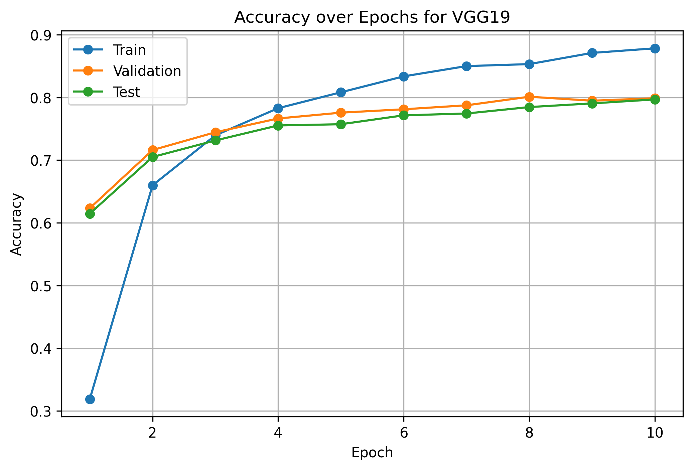
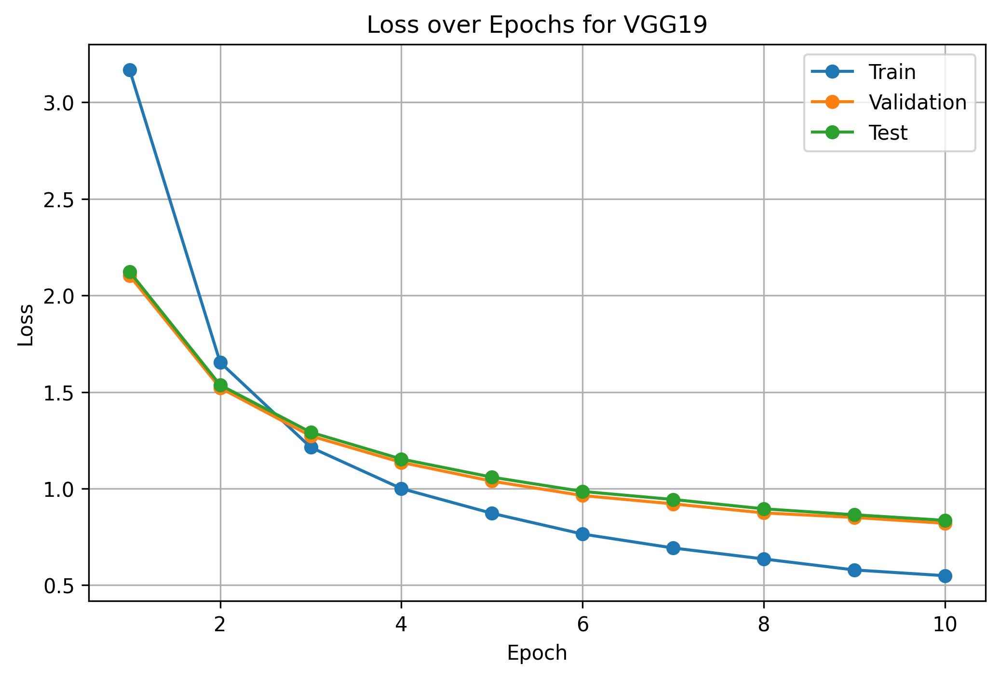
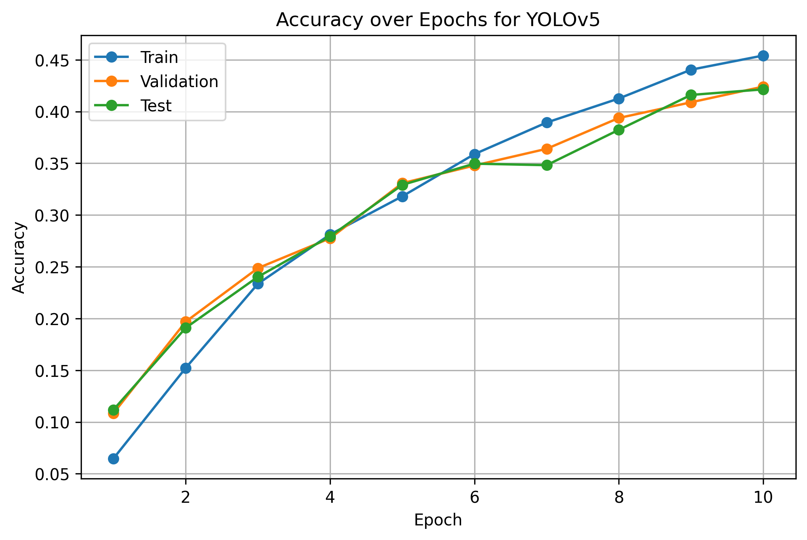
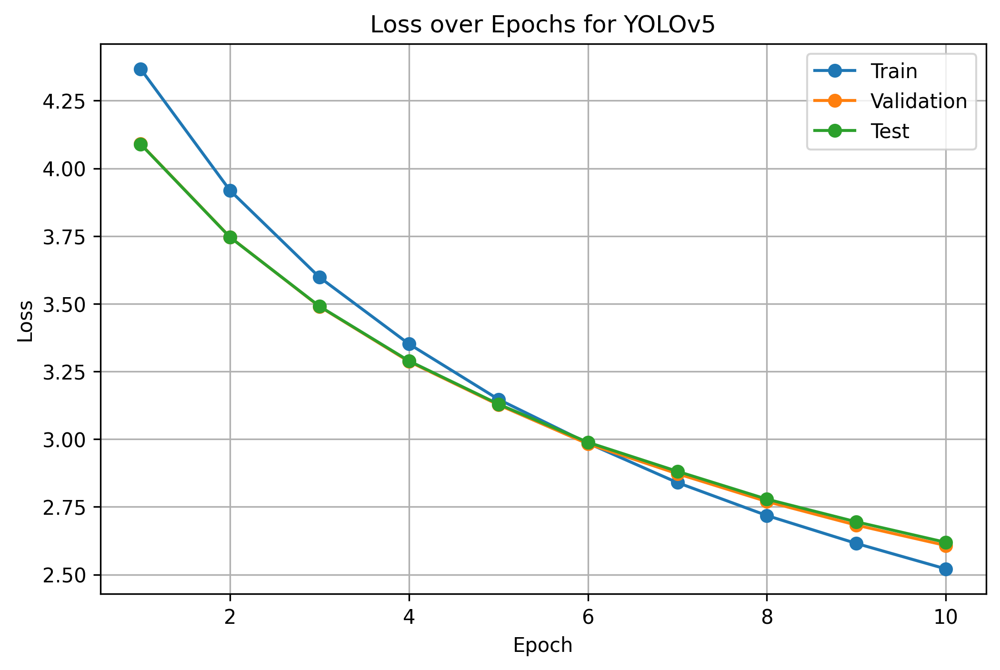

# Assignment 4 - ML BGU SISE 2026

### Team:

1. Stav Asher
2. Lior Jermin
3. Aaron Iziyaev

## Preprocessing

### The dataset

The team was tasked with fine-tuning two pre-trained convolutional neural network (CNN) models (see [Training](#Training) for more details). As part of this task, the selection and preparation of an appropriate dataset were required. The dataset used was the [102 Category Flower Dataset](https://www.robots.ox.ac.uk/~vgg/data/flowers/102).

The dataset is composed of two main components (there are more, but we had not interaction with them):

1. **Label store**, which contains image identifiers and their corresponding class labels.
2. **Image store**, which contains flower images with varying spatial dimensions.

### Preprocessing steps

Only two data preprocessing steps were applied to the dataset:

1. The labels were provided in a `.mat` file format. For convenience and compatibility with the training pipeline, these labels were converted to `.csv` format.
2. The images had varying dimensions, while each model required a fixed input size. To support consistent model input and simplify deployment, image resizing was incorporated into the preprocessing pipeline.

    - **VGG19** expects input images of size $244 \times 244$.
    The images were also normalized using the ImageNet mean and
    standard deviation in addition to dividing by 255.
    - **YOLOv5** expects input images of size $640 \times 640$.
    - For both models, image pixel values were normalized by dividing by 255.

## Training
We evaluated the following two models:
- **VGG19**: we finetuned VGG19, loaded with pre-trained weights. We then changed
the model's final layer to a new Linear layer, to classify the images according to the dataset. 
In the training we froze the original model's parameters.
- **YOLOv5**: we also finetuned YOLOv5, loaded with pre-trained weights. Since YOLOv5 is
originally for object detection, we added two new layers to the model: an average pooling layer
and a Linear layer used for classification. We hook the output of the layer before the final one
of YOLOv5, and pass its outputs through the average pooling and then the Linear classification layer.

We trained the models using the following settings:
- 10 training epochs, with a batch size of 32
- Adam optimizer, with $3\times10^{-4}$ learning rate and $1\times10^{-4}$ weight decay
- Cross Entropy Loss was used as the loss function

For each epoch, we calculates the accuracy and loss for the train, validation 
and test sets.

## Results
The final accuracy results on the test set after 10 epochs are:
- **VGG19**: 79.69%
- **YOLOv5**: 42.14%

## Summary
Below are the accuracy and loss figures over the training epochs for both models.
As can be seen, both models learn and improve their results over training: the 
accuracies of both models increase for all image sets, and the loss decreases.
However, VGG19 achieved better results than YOLOv5 - resulting in higher accuracy
and lower loss.

